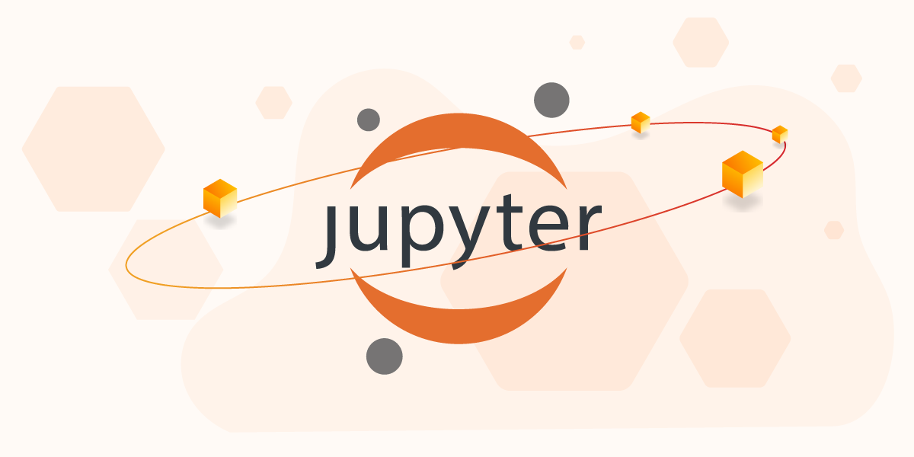

# Research-Track-II
 ##                                  Doxygen
  <p align="center">
 
  
</p>
 
 #### brief description:  
 
 Doxygen is the de facto standard tool for generatingdocumentationfrom annotatedC++ sources, 
 butitalsosupports otherpopularprogramming languagessuchasC, Objective-C, C#, PHP, Java, Python, 
 IDL (Corba, Microsoft, and UNO/OpenOfficeflavors), Fortran, VHDL Doxygen                                                                 
 •It can generate an on-line documentation browser (in HTML) and/or an off-line reference manual (in LaTeX) 
 from a set of documented source files. 
 There is also support for generating output in RTF (MS-Word), PostScript, hyperlinked PDF, compressed HTML, and Unix man pages. 
 The documentation is extracted directly from the sources, 
 which makes it much easier to keep the documentation consistent with the source code.                                                              
 •You can configure doxygento extract the code structure from undocumented source files.                                                   
 This is very useful to quickly find your way in large source distributions. 
 Doxygencan also visualize the relations between the various elements by means of include dependency graphs, 
 inheritance diagrams, and collaboration diagrams, which are all generated automatically                                                      
 •You can also use doxygenfor creating normal documentation 
 

 
 #### what we do:
 
Our work on doxygen was essentially to create a documentation on the third assignment of RT1,                                                  
where we explained the functioning of the various scriprts and how they were connected to each other.                                   
for this work we could use sphinux or doxygen and we used doxygen as it was more convenient for scripts written in C ++.                            
In our case we had two scriprts which were cont_move.cpp and novi_goal_rob.cpp.

##                                  Jupyter

 <p align="center">
 
  
</p>

#### brief description:

The Jupyter Notebook is an open source web application that you can use to create and share documents that contain live code, equations,
visualizations, and text. Jupyter Notebook is maintained by the people at Project Jupyter.
Project Jupyter is a non-profit, open-source project, 
born out of the IPython Project in 2014 as it evolved to support interactive data science 
and scientific computing across all programming languages
IPython (short for Interactive Python) was started in 2001 by Fernando Perez as an enhanced Python interpreter. 
As well as being a useful interactive interface to Python, 
IPython also provides a number of useful syntactic additions to the language. 
The Jupyter notebook is a browser-based graphical interface to the IPython shell, and builds on it a rich set of dynamic display capabilities.
Jupyter Notebooks are a spin-off project from the IPython project, which used to have an IPython Notebook project itself.
The Jupyter notebook is a browser-based graphical interface to the IPython shell, and builds on it a rich set of dynamic display capabilities.

#### what we do:

Generally our work on jupyter was to create an interactive interface with the user starting from the third assignment of RT1, 
where the user could control the robot directly from jupyter.                                       
To implement this it is necessary to understand how we had structured the third assignment of RT1, 
in order to understand how to proceed with the changes; 
in our case we had two nodes that communicated with the simulator, 
which were cont_move.cpp which managed the speeds that the robot had to assume during when it moved and the assistent control, 
and maintained continuous communication with the simulator.                                     
Then there was the navi_goal_rob.cpp Cher was essentially the user interface, 
taking input from the user and communicating directly with cont_move.cpp when changing the speed 
and with move_base when using the Go_toPoint () function.                                 
So in our case we had to rewrite this last node in jupyter, 
and instead of keyboard inputs we used wydgets, plus we reproduced the 3D view.

###   Navi_Goal_rob

   #### Description:

  this node allows for user three type of choise

  In the user interface with three choices:

  A) GO TO POINT: Where the user enters the coordinates of the point where the robot must go.

  B) CONTROLLER: Where the user moves the robot with a controller, but the robot can crash with obstacles.

  C) ASSISTENT CONTROLLER: where the user moves the robot with a controller, but the robot does not crash into obstacles, because it is equipped with laserscan which makes it stop near obstacles.

  and after reading the choise of user
  send it to other node

#### that is the library that we are used to implement the program
```py
#!/usr/bin/env python3

import rospy
from move_base_msgs.msg import MoveBaseAction
from move_base_msgs.msg import MoveBaseGoal
from geometry_msgs.msg import Point32
from nav_msgs.msg import Odometry
import actionlib
import time
from time import sleep 
import ipywidgets as widgets
from ipywidgets import Button, Layout, ButtonStyle, GridBox, VBox, HBox 
from IPython.display import display
from __future__ import print_function
from ipywidgets import interact, interactive, fixed, interact_manual 
import jupyros as jr
from jupyros import ros3d 
import os
```
###  goPoint()

  ####  Description:

This function let the user insert the coordinate of the point and                                             
if this cordinate are out of the perimeter request them again otherwise stop controller                             
and send the to server the coordinate then ask the user                            
if wont to calcel the goal and                                                       
if yes cancel the goal if no starting with timeout.                                               
    
<p align="center">
 
  
</p>

    in this function we have used two widgets floats test that take the desired coordinates 
    and two buttons one sends the goal and the other stops the function, 
<p align="center">
 
  
</p>
    we have also added a widchet check to cancel the goal.

#### function that we used to implement the function go to point

    setX():
        function used for set the coordinate X of Goal
    setY():
        function  used for set the coordinate Y of Goal
    pos_rob():
        function  used for find the coordinate of the of the robot
    V_Cancel():
        function used for check the choice of the user for canceling Goal
    SendGoal():
        function  used for send the coordinate of Goal to the server MoveBase
    Timeout():
        function used for set the timeout and to cancel the Goal if user want it
    stopping():
        function used for stop the function go_Point with closing the widgets


###  controller()

####  Description:

This function read input of the user, and set the linear and angular velocity on /vel_cont and set the assistant control to on/off
function that we used to implement the function controller, 
in this function we have used two widgets sliders that take the linear and angular speeds 
and two buttons one resets the speeds to 0 and the other stops the function, making the buttons of the main menu active.

<p align="center">
 
  
</p>

    VLin():
        function used for set the linear velocity of robot
    VAng():
        function  used for set the Angular velocity of robot
    resetV():
        function  used for reset to 0 the velocity of the robot
    stopping():
        function used for stop the function controller with closing the widgets

###  main()

####  Description:

the main function initialize the node, the nodehandler and the publisher,                                                                           
after that start with a andless loop wich calls the functions depending of the user choise break the loop and stopping the node.        
in this function we used 4 buttons (widgets)                                                                                       
3 called the functions go_to point(), Controller(), AssController(),                                                                   
and the last stop the program

<p align="center">
 
  
</p>

##### that is the call_back of the main function 
```py
if __name__ == '__main__':
 main()
```

#### function that we used to implement the function main

    On_p():
        function used for call_back function goPoint()
    contr():
        function  used for call_back function controller() Assistant_Controller = OFF
    Acontr():
        function  used for call_back function controller() Assistant_Controller = ON
    stopping():
        function used for stop the program with the function exit() exiting from program

##### that label show the 3D view of the simulation 

<p align="center">
 
  
</p>

  ##   Statistics:

   ### Description:
   For the statistics part,                                                                                                       
   we were asked to evaluate the efficiency of our solution of the first assignment of RT1;                          
   to do this we also used a solution provided by prof.                                
   To do this we tested our solution 20 times
   <p align="center">
 
  
</p>
   And we repeated the test by inserting in the arena two obstacles,                                          
   at the coordinates at (3, -4.25) (3,4.25),
   <p align="center">
 
  
</p>
   then we made the solution of prof. in order to have data that can be compared.                                                                          
   In the data collection we considered the time it took the robot starting                            
   from the first token-silver that it collected up to the ninth token-silver collected;                         
   we considered as null values (0) the trials that corresponded to,                                
   when the robot changed direction (clock-wise motion),
   when the robot crashed the wall or when the program stopped.
   <p align="center">
 
  
</p>

             the FIRST graph is about without obstacle
             the SECOND graph is about with obstacle
             BLUE= My solution
             ORANGE= Prof solution
             the file of matlab statistic.m contain all data.                                     
   
   Analyzing the data, in the case of the circuit without obstacles,                   
   we noticed that in our solution the average time is shorter,                                                            
   this is mainly due to the faster movement when the robot does not see the silver tokens;                             
   but we have a more frequent number of failures.                                                          
   So now let's try to see if a relationship between the failures that occurred in the algorithms                  
   or are only due to chance.
   H0 = due to chance.                                                           
   H1 = due to the effincency of the program.
   <p align="center">
 
  
</p>
   After calculating the value of chi2 = 1.111 and with a DOF = 1, 
   the probability of the H0 (which we have taken from the table about 32%) 
   lies between 50% (0.45) and 0.25% (1.32).
   <p align="center">
 
  
</p>
   which is a considerable percentage and for this reason I cannot reject the H0 hypothesis.
   Therefore my solution is also good as it takes less time.
   Analyzing the data, in the case of the circuit with obstacles,
   after calculating the value of chi2 = 10.417 and with a DOF = 1, 
   the probability of the H0 (which we have taken from the table ) 
   lies between 0.5% (7.88) and 0.1% (10.83).
   <p align="center">
 
  
</p>
   The probabiliti of H0 is not to high, so we can refuse the H0,
   it is not due to chance, but to the efficiency of the programs.

   #### note:
   it is fair to note that these programs have been designed to make the robot run without obstacles,
   and that the efficiency of the program DEPENDS VERY MUCH ON THE POSITION OF THE OBSTACLE.
   
   ### Conclusions and Improvements:
       To conclude we can say that to improve the efficiency of my solution 
       and better reduce the speed we give to the robot between each token check,
       plus in my solution I have implemented a sort of proportional controller, 
       but which counts the gold tokens on the right 
       and to the left regardless of how far away they are; 
       therefore, to improve it, it should count the tokens, 
       giving more weight to those that are closer than those 
       that are further away and consequently correct the trajectory.
   
